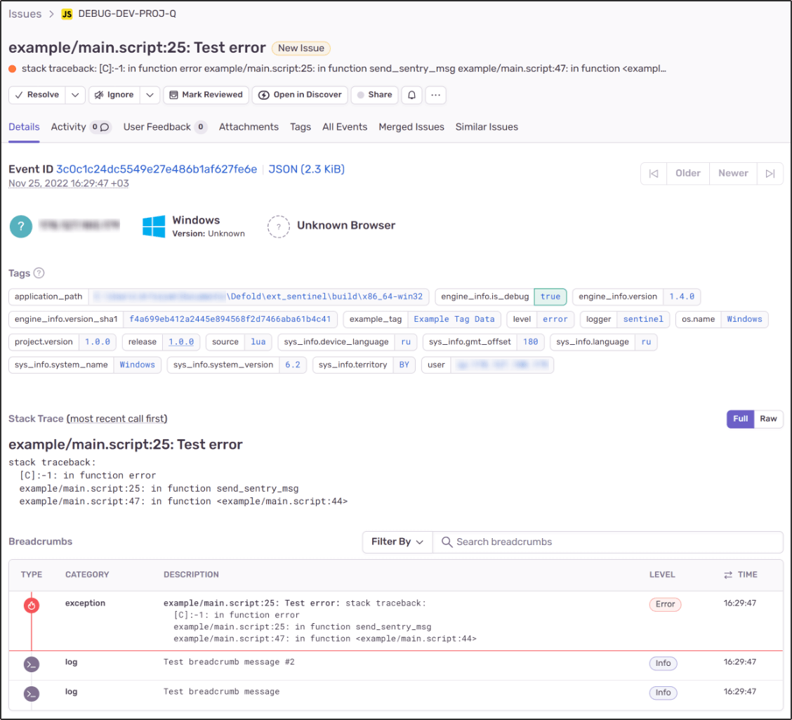

[](https://github.com/indiesoftby/defold-sentinel)

# Sentinel: Sentry.io SDK for Defold

*This is an open-source project. It is not affiliated with Sentry.io.*

[Sentry.io](https://sentry.io/) is an error tracking system. It can track errors and performance issues in any language, framework, and library.

This Defold extension, Sentinel, implements **error tracking** for your **Lua code**. Also, it can inject JavaScript SDK to track HTML5 errors if you need that.

Sentry.io is a paid system, but it has a free plan for developers to track up to 5,000 errors per month. To the point, it was enough to track down all Lua errors in [Puffy Cat](https://poki.com/en/g/puffy-cat) during a test period and release a pretty polished game.

## Supported Platforms

| Platform | Status |
| -------- | ------ |
| Lua (all platforms) | Supported ✅ |
| Browser (HTML5) | Loads JavaScript SDK to track non-Lua errors ☑️ |
| iOS, Android, Windows, macOS, Linux, Switch | Not Implemented ❌ |

## Installation & Usage

You can use Sentinel in your own project by adding this project as a [Defold library dependency](http://www.defold.com/manuals/libraries/).

Open your `game.project` file and in the dependencies field under project add the ZIP file of a [specific release](https://github.com/indiesoftby/defold-sentinel/releases).

### Init

```lua
local sentry = require("sentinel.sentry")

function init(self)
    sentry.init({
        -- The DSN tells the SDK where to send the events to.
        -- Example of the DSN url: https://a09cb15ea1224b7db88ff3681c0d574f@o43904.ingest.sentry.io/5395416
        dsn = "YOUR_DSN_URL",
        -- Tags and extra data are optional
        tags = {
            ["example_tag"] = "Example Tag Data",
        },
        extra = {
            ["example_extra"] = "Example Extra Data",
        },
        release = sys.get_config("sentinel.sentry_release")
    })
end
```

### Breadcrumbs, Capturing Messages

```lua
--- Add breadcrumbs, add tags, extras, and capture messages:
sentry.add_breadcrumb(
    {
        category = "log",
        message = "Test breadcrumb message"
    })

sentry.set_tag("my_info", "Amount of gold")
sentry.set_extra("frametime", 100)
sentry.set_extra("cheater", true)

sentry.capture_message(
    {
        message = "Test message",
        level = "info",
        -- Sentinel's Sentry client merges globally defined tags/extra with this data,
        -- i.e. you can add tags and extras for different kinds of messages and exceptions.
        extra = {
            example_extra_2 = "Hello!"
        }
    })
```



### The `game.project` Settings:

```ini
[sentinel]
sentry_dsn_html5 = YOUR_DSN_URL_FROM_SENTRY_IO
sentry_release = project-id@project-version
```

Setting the `sentinel.sentry_dsn_html5` option initializes Sentry JavaScript SDK in the HTML5 template ([take a look at how it's done](https://github.com/indiesoftby/defold-sentinel/blob/main/sentinel/manifests/web/engine_template.html#L3)).

### GameAnalytics Compatibility

Only one [`sys.set_error_handler`](https://defold.com/ref/sys/#sys.set_error_handler:error_handler) callback can be set. To track Lua errors both in GameAnalytics and Sentinel, use the option, i.e. Sentinel will send captured errors to both, Sentry and GameAnalytics:

```lua
sentry.init({
    --
    -- ... your config ...
    --
    gameanalytics = true
})
```

Plus, look into the `sentinel/sentry.lua` module to find all available configuration options!

## Credits

Artsiom Trubchyk ([@aglitchman](https://github.com/aglitchman)) is the current Sentinel owner within Indiesoft and is responsible for the open source repository.

This project uses the source code of [rxi's JSON](https://github.com/rxi/json.lua). 

Queen's Guard image is by [Chanut is Industries](https://thenounproject.com/chanut-is/).

### License

MIT license.
